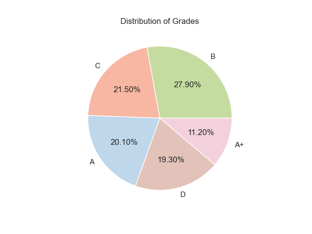
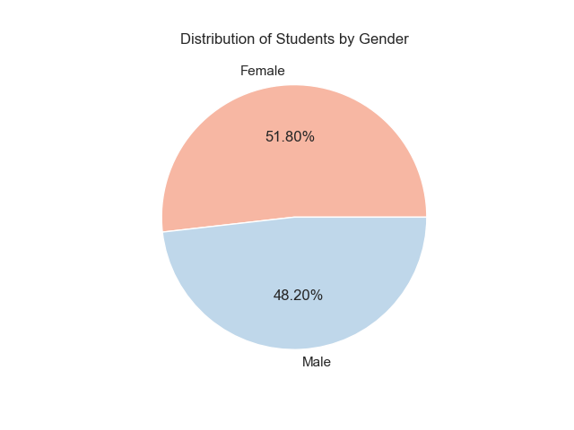
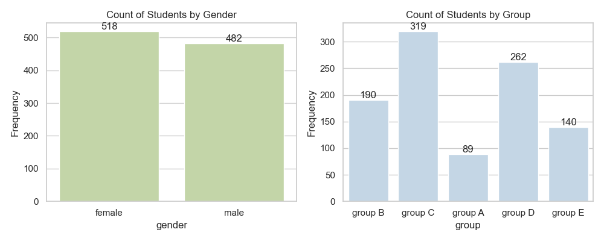
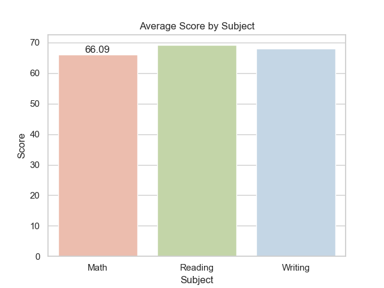
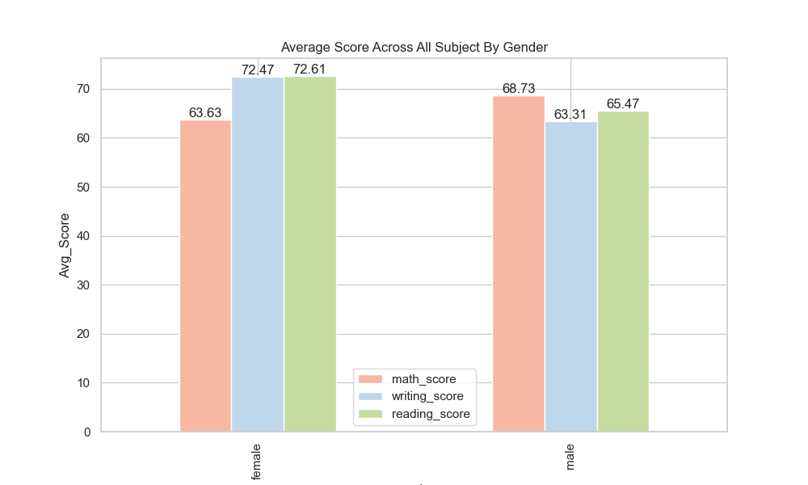
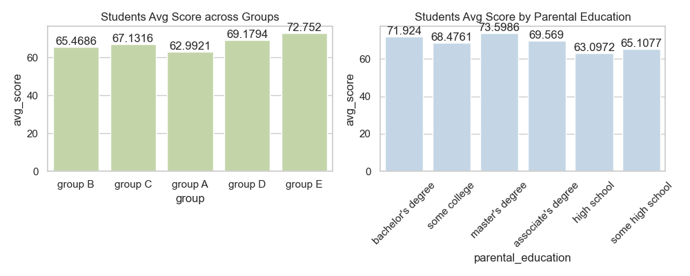
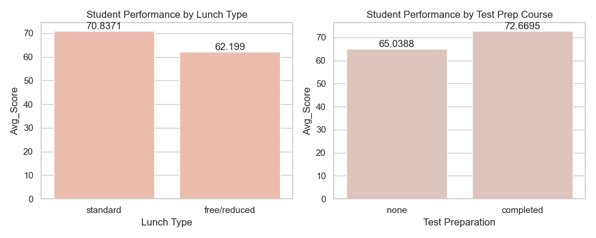
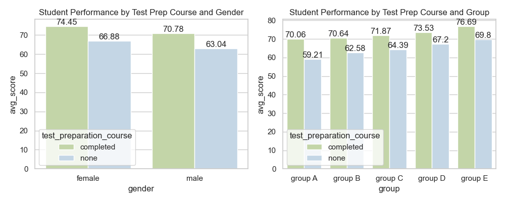
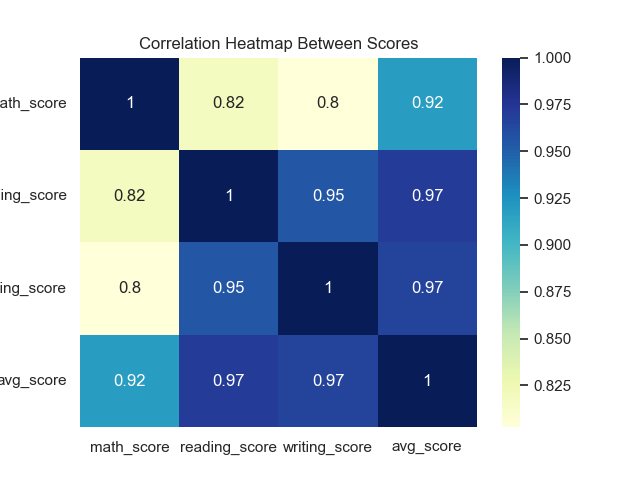

# 📊 EduTrack – Student Performance & Institutional Effectiveness

## 🧠 Project by: Achyut Patel, Rohit Sharma, and Pranav J

---

## 📌 Project Description

This project explores student performance across multiple dimensions, including gender, ethnicity, parental education, and test preparation. By analyzing real-world student exam scores, the project seeks to understand key factors affecting academic outcomes.

**Dataset Source:** [Students Performance in Exams](https://www.kaggle.com/datasets/spscientist/students-performance-in-exams)

---

## 🎯 Problem Statement

Despite increasing educational initiatives, student performance often varies due to demographic and socio-economic factors. The goal is to:
- Analyze student score trends in math, reading, and writing.
- Identify performance gaps across gender, parental education, and ethnicity.
- Provide actionable insights for institutional effectiveness.

---

## 📖 Table of Contents

1. [Project Overview](#project-overview)
2. [Data Understanding](#data-understanding)
3. [Data Cleaning](#data-cleaning)
4. [Exploratory Data Analysis (EDA)](#eda)
5. [Insights Derived](#insights-derived)
6. [Suggestions](#suggestions)
7. [Challenges Faced](#challenges-faced)
8. [Future Scope](#future-scope)
9. [Final Outcome](#final-outcome)
10. [SQL Analysis File](#sql-analysis-file)
11. [Project Credits](#project-created-by)

---

## 🧩 Project Overview

This analysis dives into students' exam performance and highlights influential factors like:
- Gender differences in scores
- Group-wise academic achievements
- Influence of parental education and test preparation

---

## 🧾 Data Understanding

- Dataset has 1000 entries with 8 categorical and 3 numerical fields.
- No missing values, but categorical columns required renaming and restructuring.
- Additional derived fields: `avg_score` and `grades`.

---

## 🧼 Data Cleaning

- Renamed columns for clarity (e.g., `math score` → `math_score`)
- Added:
  - `avg_score`: average of math, reading, and writing
  - `grades`: A+ to D, based on average score

---

## 📊 EDA

### 🧵 Distribution of Grades

### 👥 Student Gender Breakdown

### 📊 Count by Gender and Group

### 📈 Average Score by Subject

### 📊 Gender-wise Subject Scores

### 👨‍👩‍👧‍👦 Score by Group & Parental Education

### 🍱 Lunch & Test Preparation

### 📘 Test Prep Impact by Gender & Group

### 🔥 Correlation Heatmap

---

## 📍 Insights Derived

1. **Gender Differences**
   - Girls scored higher in reading & writing.
   - Boys slightly outperformed in math.

2. **Test Preparation**
   - Students completing test prep scored significantly higher.
   - Strong correlation with better grades.

3. **Parental Education**
   - Higher parental education led to better student scores.
   - Students of graduate-educated parents performed best.

4. **Ethnicity Groups**
   - Group E performed best, Group A lowest.
   - Socio-economic influence possible.

5. **Grade Distribution**
   - Most students scored in grade B or C.
   - Very few in A+.

6. **Subject Relationships**
   - Strong correlation between reading & writing.

---

## 💡 Suggestions

1. **Test Prep Works**
   - Students in test prep programs score higher.
   - Expand access or make it mandatory.

2. **Gender-Based Gaps**
   - Girls excel in reading/writing; boys slightly lead in math.
   - Offer subject-specific support by gender.

3. **Parental Education Impact**
   - Higher parental education = better student scores.
   - Provide extra help to students with less-educated parents.

4. **Group Performance Gaps**
   - Some ethnic groups consistently underperform.
   - Launch group-specific academic support.

5. **Grades Cluster at Mid-Level**
   - Most students are in B/C range.
   - Refine curriculum to lift more students to A levels.

---

## ⚠️ Challenges Faced

- Balancing **label density** in pie and bar charts.
- Ensuring the **EDA output was visually understandable** without being overwhelming.
- Creating a grading logic that fairly represented performance.

---

## 🚀 Future Scope

- Add predictive modeling to estimate student performance based on demographic factors.
- Apply clustering to segment students for targeted support.
- Integrate more diverse datasets from multiple schools or states for comparative analysis.

---

## ✅ Final Outcome

This analysis revealed:
- Gender and parental education have a measurable impact on performance.
- Institutional programs like test prep significantly improve outcomes.
- Data visualization helped stakeholders better understand performance trends and make decisions backed by evidence.

---
## 🗂️ SQL Analysis File

You can find the SQL queries and logic used for backend analysis in the following file:

📄 [`SQL Analysis File.sql`](https://github.com/A-Patel23/Student-Performance-Project/blob/73b25c892568192beb2295825f49907f9a32a6fc/Sql%20File/SQL%20Analysis%20File.sql)

---

## 🎓 Project Created By

**Achyut Patel**, **Rohit Sharma**, and **Pranav J**
---
